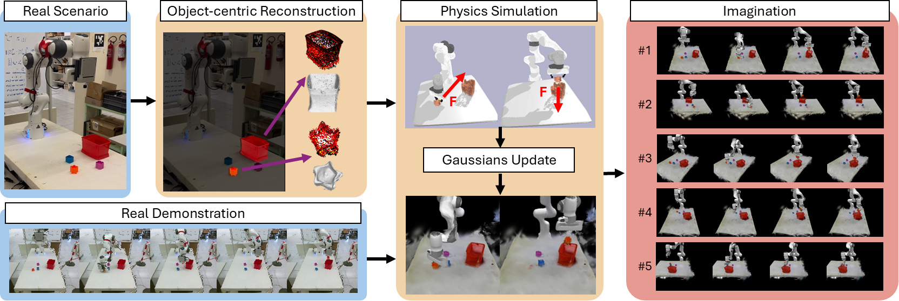

# DreMa

This is the official implementation of the paper: 

[**Dream to Manipulate: Compositional World Models Empowering Robot Imitation Learning with Imagination**](https://dreamtomanipulate.github.io/) <bR>
Leonardo Barcellona, Andrii Zadaianchuk, Davide Allegro, Samuele Papa, Stefano Ghidoni, Efstratios Gavves <br>
[ICLR 2025](https://iclr.cc/)


If you find this code useful in your research, please consider citing the paper:

```
@inproceedings{
    barcellona2025dream,
    title={Dream to Manipulate: Compositional World Models Empowering Robot Imitation Learning with Imagination},
    author={Leonardo Barcellona and Andrii Zadaianchuk and Davide Allegro and Samuele Papa and Stefano Ghidoni and Efstratios Gavves},
    booktitle={The Thirteenth International Conference on Learning Representations},
    year={2025},
    url={https://openreview.net/forum?id=3RSLW9YSgk}
}
```

## Installation
git clone --recursive https://github.com/leobarcellona/drema_code.git

Install torch (1.8.1 with CUDA 11.1 is used in the paper, but you can use other versions e.g. 2.1 cuda 11.8)
```bash

pip install torch==2.1.1 torchvision==0.16.1 torchaudio==2.1.1 --index-url https://download.pytorch.org/whl/cu118
```

Install the requirements
```bash
pip install submodules/simple-knn
pip install submodules/diff-gaussian-rasterization
pip install submodules/diff-gaussian-rasterization-depth
pip install submodules/diff-surfel-rasterization

pip install -r requirements.txt
```


## Generate the data for building the simulation
To generate the data from CoppeliaSim you need to follow the instructions in [COPPELIA.md](COPPELIA.md)

If you want to use your OWN recorded data you need to set them in the following structure:
```
task_name
  |
  |---images (contains the rgb images of the scene)
  |     |---0001.png 
  |     |---0002.png
  |
  |---depth_scaled (contains the depth images of the scene)
  |     |---0001.npy 
  |     |---0002.npy
  |
  |---object_mask (contains the segmentations masks of the scene)
  |     |---0001.png 
  |     |---0002.png
  |
  |---object_pose (contains the intrinsics and extrinsics of the objects)
  |     |---0001.txt
  |     |---0002.txt
  |
  |---labels.txt (contains the <name;label> of the objects)
 ```

The object pose files should follow this format:
```
r1 r2 r3 t1
r4 r5 r6 t2
r7 r8 r9 t3
0 0 0 1

fx 0 cx
0 fy cy
0 0 1
```
where r1-r9 are the rotation matrix, t1-t3 are the translation vector, fx and fy are the focal length and cx and cy are the center of the image all respect to the world frame.

### Sample data

Download the sample simulation data from the following link and extract it to the `data` folder:
[Sample Data](https://drive.google.com/drive/folders/1h5Jdxo-3VvFj5TU07FqdYlkMzgWLfuYA?usp=sharing)  
The `slide_block` scene contains the necessary data required by `simulation.py` (stored in the `output` folder).  
To recreate the data, delete the `output` folder.

## Build the simulation



Before creating the simulation you need to set the paths in the config files:
1. set the correct path in configs/config.yaml
2. (if needed) set the config/training/coppelia_params.yaml file with the correct parameters (e.g use depth images or not, use 2DGS or 3DGS etc.)
3. ``` python create_simulation.py ```

**Note:**  
To extract the objects, you must first extract the table to filter the mesh. 
The code will create assets in the `assets_path`.
If you encounter issues after modifying the code, we recommend removing the `assets_path` directory and rerunning the process.


## Execute simulation
To execute the simulation, you need to follow the following steps:
1. Change data and assets paths in config.yaml and simulation/coppelia_simulation.yaml (if needed).
2. Run the following command to execute the simulation: 
``` python simulate.py ```
3. You can visualize and adjust the simulation by modifying the configuration file.  
   By default, the simulation will execute the given trajectory continuously.  
   - Press `r` to reset the environment.
   - Press `q` to quit.

You can visualize the scene from:
- The camera used to reconstruct the scene (set `visualize_training_cameras=True`).
- The cameras in the demonstrated trajectory (set `visualize_trajectory_cameras=True`).
- The PyBullet GUI camera (set `pybullet_camera=True`).

## Extract augmentation data

To extract the augmentation data you need to run ```python generate_new_data.py```. 
The configuration file used are the same of simulate.py. Data is generated in "generation.generated_data_path" location.
Be sure to change the flag to save images and enable the different augmentations to generate the data.

You can visualize the generated data by running ```python visualize_new_data.py ```

Notes: for the paper the filter used is radius filter, but here we used Scharr filter for faster generation. 
If you avoid visualizing the simulation, the generation will be faster.

## Training peract
To train peract you need to follow the instructions in the original repository and the information in [COPPELIA.md](COPPELIA.md)

<b>Wrist camera:</b> currently, the wrist camera is not correctly rendering. This is caused by the distance of the camera from the guassians. We still need to find a way to fix this issue.
That is the reason fo using three cameras in the experiments.

# References
The code is based on the following repositories (thanks to the authors for sharing their code). 
Please consider citing their work too:
- [Gaussian Splatting](https://repo-sam.inria.fr/fungraph/3d-gaussian-splatting/)
- [2DGS](https://surfsplatting.github.io/)
- [RLBench](https://sites.google.com/view/rlbench)
- [PerAct](https://peract.github.io/)
- [GNFactor](https://github.com/YanjieZe/GNFactor)

The code is intended for research purposes only.
